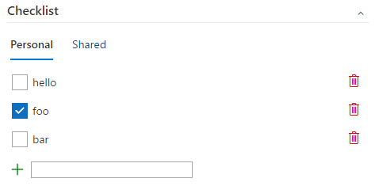

# Work Item checklist

[Note]: This extension is also part of another extension published by me - <a href="https://marketplace.visualstudio.com/items?itemName=mohitbagra.vsts-wit-control-library">Work item form control library</a>.
The previous extension was meant to provide various samples of work item form extensions. In this extension, I am forking out just the checklist custom work item form group as a separate extension.

A work item form group extension that lets user enter TODO list items for an individual workitem. These list items are stored stored in the extension's data storage and not as a field value or any other work item. These items are not bound to any work item field. 
Users can add, remove any checklist item and mark them as checked or unchecked. This extension shows 2 types of checklists - "Personal" and "Shared". Personal checklist is private to each user. Shared list is shared with the whole account for a workitem. The items are stored per workitem, so each workitem would have its own checklist.

